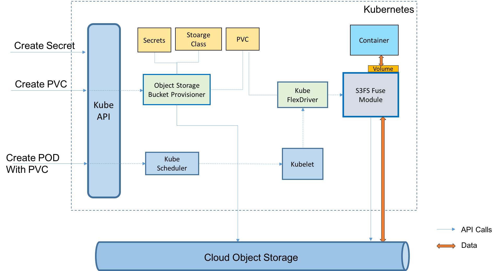

# IBM Cloud Object Storage plug-in
IBM Cloud Object Storage plug-in is a Kubernetes volume plug-in that enables Kubernetes pods to access IBM Cloud Object Storage buckets. The plug-in has two components: a dynamic provisioner and a FlexVolume driver for mounting the buckets using s3fs-fuse on a worker node.


## Prerequisites
Before installing IBM Cloud Object Storage plug-in in a Kubernetes cluster, ensure:
1. [RBAC](https://kubernetes.io/docs/admin/authorization/rbac/) should be enabled for the Kubernetes cluster.<br>
2. [S3FS-FUSE](https://github.com/s3fs-fuse/s3fs-fuse#installation) should be installed on every worker node in the cluster.

## Build the `provisioner` image and `driver` binary
For building the **provisioner** image and the **driver** binary, `docker`, `GO` and `glide` should be installed on your local system.<br>
1. On your local machine, install [`docker`](https://docs.docker.com/install/), [`Go`](https://golang.org/doc/install), and [`glide`](https://glide.sh/).
2. Set the [`GOPATH` environment variable](https://github.com/golang/go/wiki/SettingGOPATH).
3. Build the provisioner container image and the driver binary<br>
   clone the repo or your forked repo
   ```
   $ mkdir -p $GOPATH/src/github.com/IBM
   $ mkdir -p $GOPATH/bin
   $ cd $GOPATH/src/github.com/IBM/
   $ git clone https://github.com/IBM/ibmcloud-object-storage-plugin.git
   $ cd ibmcloud-object-storage-plugin
   ```
   build project and runs testcases
   ```
   $ make
   ```
   build container image for the provisioner
   ```
   $ make provisioner
   ```
   build driver binary
   ```
   $ make driver
   ```
   You can find the driver binary under `$GOPATH/bin` directory with name `ibmc-s3fs`.<br>
   Run `docker images` command to view the provisioner container image by name `ibmcloud-object-storage-plugin`.

## Provisioner image
Push the provisioner container image from the build system to your image repository, the one being used for your Kubernetes cluster. Refer to [docker push](https://docs.docker.com/engine/reference/commandline/push/)

## Installation
1. Copy driver binary `ibmc-s3fs` from your build system to each worker node, under `/tmp/`
2. On every worker node execute following commands to copy the driver binary `ibmc-s3fs` to [Kubernetes plugin directory](https://github.com/kubernetes/community/blob/master/contributors/devel/sig-storage/flexvolume.md):
   ```
   $ sudo mkdir -p /usr/libexec/kubernetes/kubelet-plugins/volume/exec/ibm~ibmc-s3fs
   $ sudo cp /tmp/ibmc-s3fs /usr/libexec/kubernetes/kubelet-plugins/volume/exec/ibm~ibmc-s3fs
   $ sudo chmod +x /usr/libexec/kubernetes/kubelet-plugins/volume/exec/ibm~ibmc-s3fs/ibmc-s3fs
   $ sudo systemctl restart kubelet
   ```
3. Create the provisioner.<br>
   Before executing following command update `image` details as per your repository in `deploy/provisioner.yaml`. Currently, it is `image: ibmcloud-object-storage-plugin:latest`, which expects image to be in public docker hub
   ```
   $ kubectl create -f deploy/provisioner-sa.yaml
   $ kubectl create -f deploy/provisioner.yaml
   ```

4. Create the storage class
   ```
   $ kubectl create -f deploy/ibmc-s3fs-standard-StorageClass.yaml
   ```

### Verify IBM Cloud Object Storage plug-in installation
    $ kubectl get pods -n kube-system | grep object-storage
      ibmcloud-object-storage-plugin-7c96f8b6f7-g7v98   1/1       Running   0          28s

    $ kubectl get storageclass |grep s3
      ibmc-s3fs-standard           ibm.io/ibmc-s3fs

## Usage

### Create Secret
To enable the plug-in to access the object storage, you need to share your access keys as secret.
If you want to use IBM Cloud Object Storage access keys, then use **`access-key`** and **`secret-key`**.<br>
If you want to use IBM IAM OAuth instead of `access-key`, use **`api-key`** and **`service-instance-id`**.

All keys should be encoded in base64 using ```echo -n "<key_value>" | base64```<br>

Create secret:<br>
```
kubectl apply -f - <<EOF
apiVersion: v1
kind: Secret
type: ibm/ibmc-s3fs
metadata:
  name: test-secret
  namespace: <NAMESPACE_NAME>
data:
  access-key: <access key encoded in base64 (when not using IAM OAuth)>
  secret-key: <secret key encoded in base64 (when not using IAM OAuth)>
  api-key: <api key encoded in base64 (for IAM OAuth)>
  service-instance-id: <service-instance-id encoded in base64 (for IAM OAuth + bucket creation)>
EOF
```
**Note**: Replace **<NAMESPACE_NAME>** with your namespace (for example: default).<br>
          The `secret` and `PVC` should be created in same namespace.

### Create a PVC and POD
1. Create PVC.<br>
   ```
   kubectl apply -f - <<EOF
   kind: PersistentVolumeClaim
   apiVersion: v1
   metadata:
     name: s3fs-test-pvc
     namespace: <NAMESPACE_NAME>
     annotations:
       volume.beta.kubernetes.io/storage-class: "ibmc-s3fs-standard"
       ibm.io/auto-create-bucket: "true"
       ibm.io/auto-delete-bucket: "false"
       ibm.io/bucket: "<BUCKET_NAME>"
       ibm.io/object-path: ""    # Bucket's sub-directory to be mounted (OPTIONAL)
       ibm.io/endpoint: "https://s3-api.dal-us-geo.objectstorage.service.networklayer.com"
       ibm.io/region: "us-standard"
       ibm.io/secret-name: "test-secret"
       ibm.io/stat-cache-expire-seconds: ""   # stat-cache-expire time in seconds; default is no expire.
   spec:
     accessModes:
       - ReadWriteOnce
     resources:
       requests:
         storage: 8Gi # fictitious value
   EOF
   ```
   **Note**: Replace **<BUCKET_NAME>** and **<NAMESPACE_NAME>.**<br>
             The `secret` and `PVC` should be in same namespace.<br>
   For end-point and region refer to [AWS CLI](https://console.bluemix.net/docs/infrastructure/cloud-object-storage-infrastructure/cli.html#using-a-cli).

2. Verify the PVC, `s3fs-test-pvc`, creation.
   ```
   $ kubectl get pvc -n <NAMESPACE_NAME>
   NAME            STATUS    VOLUME                                     CAPACITY   ACCESSMODES   STORAGECLASS         AGE
   s3fs-test-pvc   Bound     pvc-9167eace-b194-11e7-bc69-dab1a668f971   8Gi        RWO           ibmc-s3fs-standard   35s
   ```
   If `STATUS` is `Bound` then the PVC has been created successfully.

3. Create a POD using the PVC.<br>
   ```
   kubectl apply -f - <<EOF
   apiVersion: v1
   kind: Pod
   metadata:
     name: s3fs-test-pod
     namespace: <NAMESPACE_NAME>
   spec:
     containers:
     - name: s3fs-test-container
       image: anaudiyal/infinite-loop
       volumeMounts:
       - mountPath: "/mnt/s3fs"
         name: s3fs-test-volume
     volumes:
     - name: s3fs-test-volume
       persistentVolumeClaim:
         claimName: s3fs-test-pvc
   EOF
   ```


5. Verify the POD and the volume.<br>
   Verify that the `s3fs-test-pod` POD is in `Running` state.<br>
   ```
   $ kubectl get pods -n <NAMESPACE_NAME> | grep s3fs-test-pod
     s3fs-test-pod                 1/1       Running   0          28s
   ```
   Get into the POD `kubectl exec -it s3fs-test-pod -n <NAMESPACE_NAME> bash`<br>
   and run the following commands to verify access to the mounted bucket:
   ```
   $ kubectl exec -it s3fs-test-pod -n <NAMESPACE_NAME> bash
   root@s3fs-test-pod:/#
   root@s3fs-test-pod:/# df -Th | grep s3
   s3fs           fuse.s3fs  256T     0  256T   0% /mnt/s3fs

   root@s3fs-test-pod:/# cd /mnt/s3fs/
   root@s3fs-test-pod:/mnt/s3fs# ls
   root@s3fs-test-pod:/mnt/s3fs#

   root@s3fs-test-pod:/mnt/s3fs# echo "IBM Cloud Object Storage plug-in" > sample.txt
   root@s3fs-test-pod:/mnt/s3fs# ls
   sample.txt
   root@s3fs-test-pod:/mnt/s3fs# cat sample.txt
   IBM Cloud Object Storage plug-in
   root@s3fs-test-pod:/mnt/s3fs#
   ```
### Use Custom CA Bundle

   **Note**: It is recommended to expose Kube Dns on Worker Nodes before performing below steps.

   Pass the ca-bundle key in the cos secret with parameter `ca-bundle-crt` along with `access-key` and `secret-key`.

   Sample Secret:

   ```
	apiVersion: v1
	kind: Secret
	type: ibm/ibmc-s3fs
	metadata:
  	  name: test-secret
  	  namespace: <NAMESPACE_NAME>
	data:
  	  access-key: <access key encoded in base64 (when not using IAM OAuth)>
	  secret-key: <secret key encoded in base64 (when not using IAM OAuth)>
	  api-key: <api key encoded in base64 (for IAM OAuth)>
 	  service-instance-id: <service-instance-id encoded in base64 (for IAM OAuth + bucket creation)>
      ca-bundle-crt: < TLS Public cert bundles encoded in base64>
  ```

   Create PVC by providing COS-Service name and COS-Service namespace

   Sample  PVC template:

   ```
   kind: PersistentVolumeClaim
   apiVersion: v1
   metadata:
     name: s3fs-test-pvc
     namespace: <NAMESPACE_NAME>
     annotations:
       volume.beta.kubernetes.io/storage-class: "ibmc-s3fs-standard"
       ibm.io/auto-create-bucket: "true"
       ibm.io/auto-delete-bucket: "false"
       ibm.io/bucket: "<BUCKET_NAME>"
       ibm.io/object-path: ""    # Bucket's sub-directory to be mounted (OPTIONAL)
       ibm.io/region: "us-standard"
       ibm.io/secret-name: "test-secret"
       ibm.io/stat-cache-expire-seconds: ""   # stat-cache-expire time in seconds; default is no expire.
       ibm.io/cos-service: <COS SERVICE NAME>
       ibm.io/cos-service-ns: <NAMESPACE WHERE COS SERVICE IS CREATED>
   spec:
     accessModes:
       - ReadWriteOnce
     resources:
       requests:
         storage: 8Gi # fictitious value

  ```
## Uninstall
   Execute the following commands to uninstall/remove IBM Cloud Object Storage plugin from your Kubernetes cluster:
   ```
   $ kubectl delete deployment ibmcloud-object-storage-plugin -n kube-system
   $ kubectl delete clusterRoleBinding ibmcloud-object-storage-plugin ibmcloud-object-storage-secret-reader
   $ kubectl delete clusterRole ibmcloud-object-storage-plugin ibmcloud-object-storage-secret-reader
   $ kubectl delete sa ibmcloud-object-storage-plugin -n kube-system
   $ kubectl delete sc ibmc-s3fs-standard
   ```
